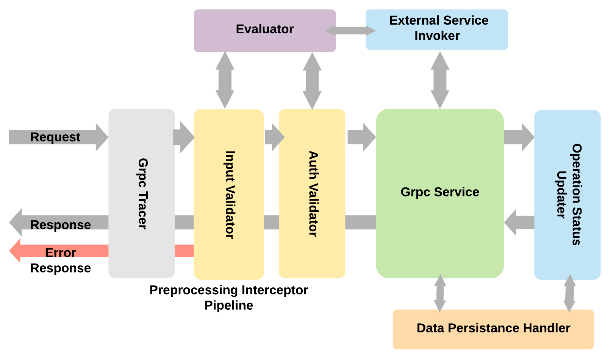

## Go + gRPC-Gateway(V2) 构建微服务实战系列

1. [云原生 API 网关，gRPC-Gateway V2 初探](https://mp.weixin.qq.com/s/9qDUDrYBgOWQ3s_jHxK4fQ)
2. [Go + gRPC-Gateway(V2) 构建微服务实战系列，小程序登录鉴权服务：第一篇](https://mp.weixin.qq.com/s/OVyiFknEiN6e6WvZ6Dh9pg)
3. [Go + gRPC-Gateway(V2) 构建微服务实战系列，小程序登录鉴权服务：第二篇](https://mp.weixin.qq.com/s/u5_bE58sMr4BNNMq1-H09Q)
4. [Go + gRPC-Gateway(V2) 构建微服务实战系列，小程序登录鉴权服务(三)：RSA(RS512) 签名 JWT](https://mp.weixin.qq.com/s/Ksb0ql-wx7SqnfQMia9HLg)
5. [Go+gRPC-Gateway(V2) 微服务实战，小程序登录鉴权服务(四)：自动生成 API TS 类型](https://mp.weixin.qq.com/s/8vY3KTggFH4PUHmX5P2_mw)
6. [Go+gRPC-Gateway(V2) 微服务实战，小程序登录鉴权服务(五)：鉴权 gRPC-Interceptor 拦截器实战](https://mp.weixin.qq.com/s/o8qHdzd6kTct1s2HyL-bCw)

